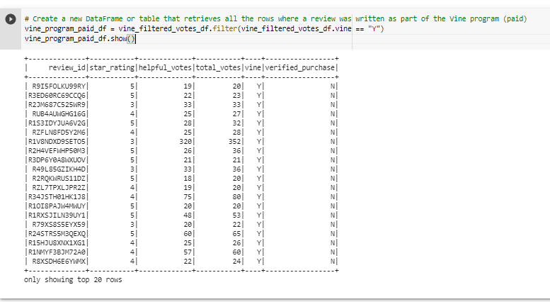
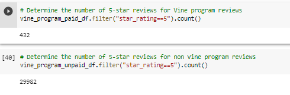

# Amazon_Vine_Analysis

## Overview of Project

Analyse Amazon reviews data for specific product category (toys in our case) to determine if having a paid Vine review makes a difference in the percentage of 5-star reviews.

**Purpose:**
The purpose of this project is to determine if there is any bias towards reviews that were written as part of the Vine program (we are using Amazon reviews dataset for Toys purchases). 

**Task:** 
Determine if having a paid Vine review makes a difference in the percentage of 5-star reviews.

**Approach:**

*Perform ETL on Amazon Product Reviews*
- Use PySpark to perform the ETL process to extract the dataset, transform the data, connect to an AWS RDS instance, and load the transformed data into pgAdmin

*Determine Bias of Vine Reviews*
- Use PySpark, Pandas, or SQL to determine if there is any bias toward favorable reviews from Vine members in the toys reviews dataset

*A Written Report on the Analysis*
- Write a summary of the analysis

**Method:** Using AWS RDS, PgAdmin, PySpark, Google Collab.

## Resources
- Data Source: [Amazon_Reviews_data](https://s3.amazonaws.com/amazon-reviews-pds/tsv/amazon_reviews_us_Toys_v1_00.tsv.gz); 
- Source Code: 
    [Amazon_Reviews_ETL.ipynb](Amazon_Reviews_ETL.ipynb); [Vine_Review_Analysis.ipynb](Vine_Review_Analysis.ipynb);
  
- Programming Languages: Python; SQL
- Software/Tools: AWS RDS, PostgreSQL, PgAdmin, Google Collab, VS Code

## Results
The following 4 tables were created using AWS RDS, PostgresSQL, PgAdmin, Google Collab and Pyspark. 

**Customers Table**

**Products Table**

**Review ID Table**

**Vine Table**

### We first create two dataframes separating reviews for Vines program (paid) and Non-Vines (unpaid) -> see pictures below

**How many Vine reviews and non-Vine reviews were there?**

- There were 1266 Vines reviews and 62028 non-Vines reviews

**How many Vine reviews were 5 stars? How many non-Vine reviews were 5 stars?**

- There were 432 Vines reviews that were rated as 5 stars
- There were 29982 non-Vines reviews that were rated as 5 stars

**What percentage of Vine reviews were 5 stars? What percentage of non-Vine reviews were 5 stars?**

- 34% of Vines reviews were 5 stars
- 48% of non-Vines reviews were 5 stars

## Summary
 **Is there any positivity bias for reviews in the Vine program?**
 Looking at both Vine and non-Vine 5 stars review percentages (34% vs 48%) we can say that **there is not** a positivity bias for reviews in the Vine program.

 
 
 To support the statement above we should consider performing hypothesis testing using 
  